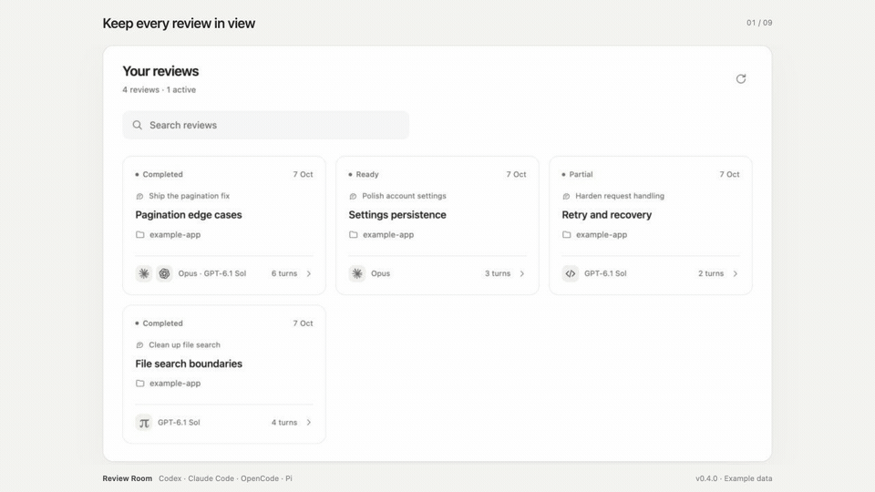
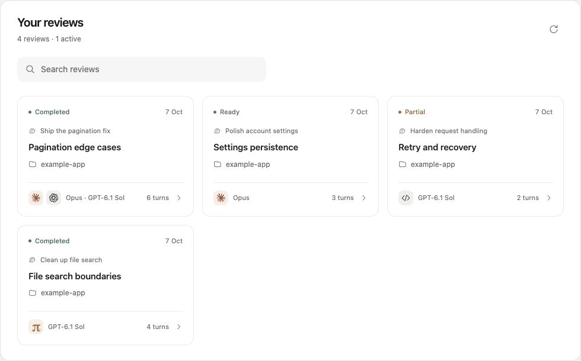
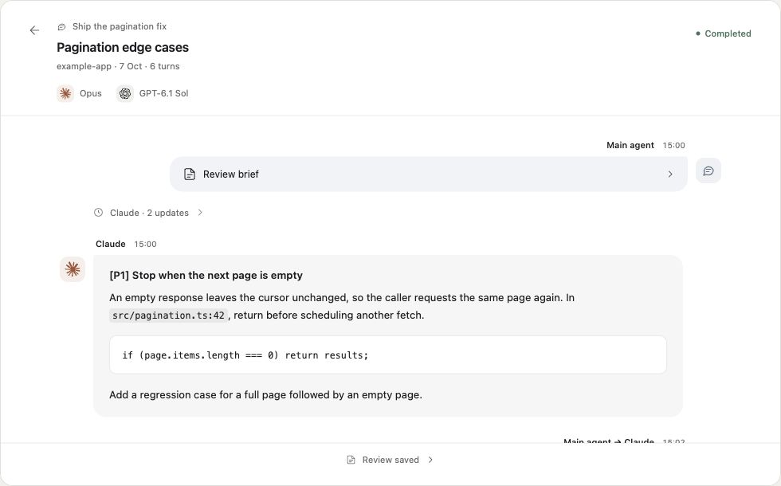
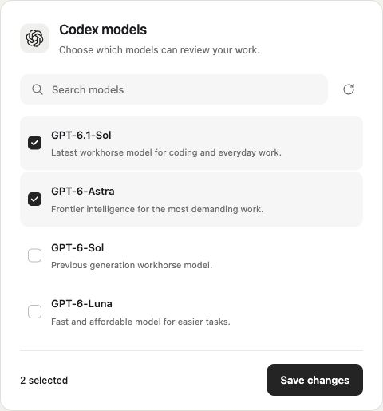

# Review Room

A local Codex plugin for agent-led code reviews with Codex, Claude Code, OpenCode, and Pi. Your chat agent chooses enabled reviewers, discusses their findings, and collects a Markdown report. A native panel shows review cards, chat titles, and the conversation between reviewers.



[Browse the screenshots](#screenshots)

*The walkthrough and screenshots show the v0.4.0 interface with example review data and model choices.*

## Install in Codex

Install [Bun](https://bun.sh/) and sign in to at least one supported CLI. Review Room targets macOS and Linux. The repository includes its bundled runtime, so installing the plugin does not require a dependency install or build.

```sh
codex plugin marketplace add limineol/review-room
codex plugin add review-room@review-room
```

Reopen the plugin after installation. In **Plugins → Review Room → Settings**, enable a harness and choose its allowed models. New installations start with every harness disabled; adding or discovering a model never enables it automatically.

Ask your chat agent:

> Review my current changes with Review Room. Discuss any uncertain findings with the reviewer before proposing fixes.

The agent starts and manages reviews. Open Review Room to browse their cards and conversations. Prompts, review findings, and follow-up questions remain available in the discussion, with expandable briefs and activity groups.

## Harnesses and models

| Harness | Model discovery | Reviewer tools |
| --- | --- | --- |
| Codex | App-server model catalog | Read-only sandbox; user rules and plugins disabled |
| Claude Code | CLI initialization catalog | Read, Grep, Glob; safe and restricted modes |
| OpenCode | Configured provider/model catalog | Read, grep, glob, list; writes, shell, subagents, and external paths denied |
| Pi | RPC model catalog | Read, grep, find, ls; repository path guard; extra extensions, MCP tools, and context files disabled |

Model pickers show readable names and provider details. **Refresh** updates the catalog, and **Save changes** persists the allowlist before requesting that the host close the picker. Failed refreshes retain the previous choices. A catalog entry is not a guarantee that the account can invoke that model.

Integration checks used OpenCode 1.18.34 and Pi 1.0.4. Pi completed live review, follow-up, and repository-boundary checks. OpenCode’s catalog and permission preflight are verified; its live model invocation is pending verification. Older CLIs that lack the required isolation or RPC flags are not supported.

OpenCode and Pi use qualified model IDs such as `provider/model`. Their own CLI configuration supplies authentication; Review Room does not ask you to paste API keys into the plugin. Review requests use your provider account and can consume its quota or incur its normal charges.

OpenCode's pure mode disables external plugins. Before a review, Review Room disables configured MCP servers for that process and checks the resolved agent permissions; it refuses to start if extra tools or external paths remain allowed. Providers that require an external authentication plugin may be unavailable in that mode. Pi starts only after confirming that Review Room's bundled read-only guard loaded. These tool restrictions are not an operating-system sandbox; use a separately isolated environment when you need stronger isolation.

## Review workflow

1. The chat agent discovers your enabled harness/model combinations.
2. It writes a review brief against the live repository and starts a cycle.
3. Reviewers inspect files and can ask the agent or another reviewer questions.
4. The agent evaluates findings, collects the report, implements appropriate fixes, and requests another cycle when needed.

The panel renders sanitized Markdown, provider icons, and message bubbles. It does not show private model reasoning. The originating chat title appears when the agent supplies a verified title; older unlabelled reviews show “Chat not recorded.”

Sessions continue within a cycle. **Reuse reviewer sessions between cycles** defaults off. When enabled, reuse is scoped to the room, repository, reviewer name, harness, and model. Settings also bound reviewers per cycle, total turns, and per-turn timeouts.

One failed reviewer does not discard other findings. Partial reports identify failures. Interrupted or expired sessions are reported, and missing saved history is retried once with a fresh session and recent discussion context. Active work depends on its MCP process remaining alive; ready findings survive restarts.

## Screenshots

**Review cards** keep the originating chat, project, reviewers, and status together.



**The discussion** preserves the brief, findings, follow-up questions, and saved report.



**Model selection** uses a searchable catalog with readable names and explicit choices.



## Agent tools

| Tool | Purpose |
| --- | --- |
| `review_discover` | Installed harnesses, model catalogs, enabled combinations, and limits |
| `review_prompt_guide` | Instructions for the review loop |
| `review_start` | Start reviewers against a live repository; pass `threadTitle` when known |
| `review_set_thread_title` | Label an existing room with its verified chat title |
| `review_send` | Send a question to one reviewer or all |
| `review_wait` | Wait for published messages using a cursor |
| `review_collect` | Save the cycle's findings and discussion as Markdown |
| `review_read` / `review_stop` | Read a cycle or stop its reviewers |
| `open_review_room` | Open the native review panel |

`review_wait` is an active wait; Review Room does not wake an idle chat. A review reads current repository files, so avoid editing the same files during inspection or ask reviewers to recheck them afterward.

## Data and runtime

Review Room stores settings and history in `~/.local/share/review-room/agent-reviews.sqlite` and reports in `~/.local/share/review-room/artifacts/`. Native harnesses also retain their own session data; Pi's Review Room sessions live below the plugin's data directory. Source and prompts are sent through your selected CLI to its configured provider.

Review Room has no hosted backend or developer telemetry service. It is a local MCP plugin. A hosted edition for the public ChatGPT directory is deferred; this release is distributed through GitHub and the Codex marketplace above.

## Development

Use Bun 1.3.14 or later. Dependency versions are pinned.

```sh
bun install --frozen-lockfile
bun run check
bun run build
bun test
bun run package /tmp/review-room-release
```

`mcp.json` is the portable manifest; `.mcp.json` and `.codex-plugin/plugin.json` provide Codex compatibility. The four runtime files under `dist/` are committed so GitHub marketplace installs are ready to run. Rebuild them after source changes. `spikes/events-probe` is historical experimentation and is excluded from release archives.

Report bugs or request features through [GitHub Issues](https://github.com/limineol/review-room/issues). Include the harness and version, but remove source code, credentials, and private review content from logs you share.

## License

[MIT](LICENSE), copyright Daniel Alvim. Bundled dependencies retain their [third-party notices](dist/THIRD_PARTY_NOTICES.txt). Provider icons retain the notices in [assets/ICONS-LICENSE.txt](assets/ICONS-LICENSE.txt).
